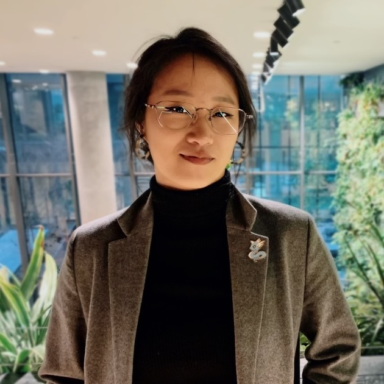
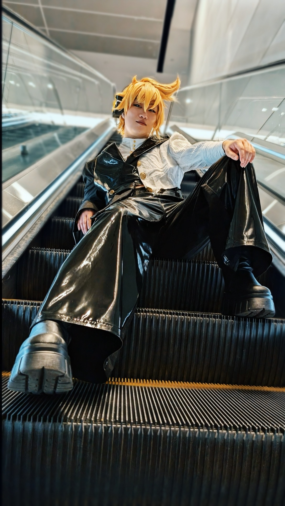
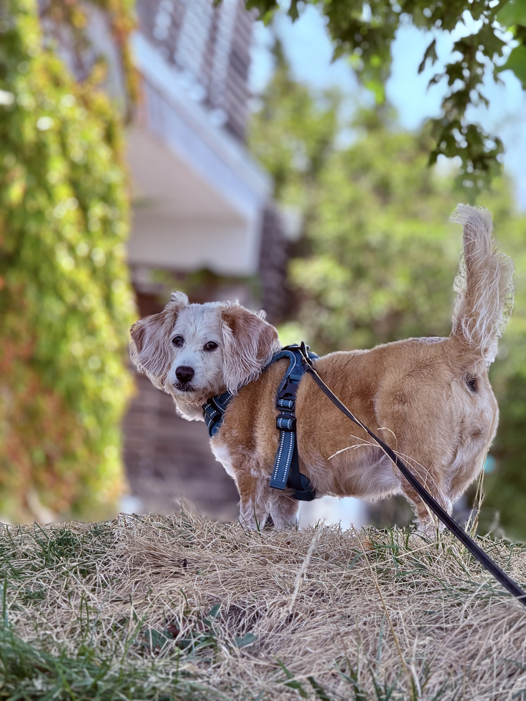

# Ally_Han.exe

## What is this?
Hello comrades and colleagues! This document provides some information about how to best collaborate with me, who I am, and how that affects my workstyle. It should serve as a casual contract of how you can expect me to show up in the workplace. It's a working, living document, so please feel free to ask for more information, clarification, or further discussion of anything present

## 💼 Working with Me
### ⏱️ Peak Productive and AFK Hours
I'm based in NYC (Eastern Standard Time).
| Status | EST | PST | CST
| ----------- | ----------- | ----------- | ----------- |
| Responsive | 9:00am - 5:00pm Daily| 6:00am - 2:00pm | 8:00am - 4:00pm |
| Away (Walking Maple) | 30min Tues/Wed | Wherever Possible | Between meetings |
| Away (Physical Therapy) | 9:30-11:30am Mon| 6:30-8:30am Mon| 8:30-10:30am Mon|
| Solo Code / Unresponsive   (deadline dependant) | 5:00pm - Task Complete | 2:00pm -  | 4:00pm -  |

---

### 🗣️ The Best Way to Communicate with Me
#### In Meetings
- I feel most able to communicate my thoughts and ideas in a prepared and organized manner. For most ad hoc meetings, I will come with an agenda prepared. **Whenever pitching or suggesting new projects, ideas, or operations, I prefer to create an deck, even when the session is casual in nature**. I have no preferences for intaking information, so dealers choice! ╮(︶▽︶)╭

#### In Pairing Sessions
- **Regularly scheduled, but easily cancellable sessions** to discuss what we are working on, help each other by being a rubber duck, and to casually yap is the best way for me to connect with remote colleagues.   Having a designated time block for active collaboration helps me reduce required transition time introduced by ad hoc calls, and holds space for any issues, bugs, experiences, or piping hot tea you end up wanting to discuss with me. **Let's work together to find a cadence that is comfortable for us!**

#### For Async Communications
- Slack, emails, the usual. So long as you are contacting me **during my peak responsive hours**, and I'm not head down on something else, you can **expect a very quick response**.

---

### 🗳️ How I like to recieve Feedback
- **1 on 1** rather than in a group
- **In two sessions**, one to initially give feedback, and one to discuss after I've done some processing. Ideal during 1-1s or Pairing Sessions

  

#  My Identity (๑˃ᴗ˂)ﻭ
| This is Me | This is also Me | This is Maple
| ----------- | ----------- | ----------- |
|  |  |  |

### 🙏 Things that I need
---
#### Proactive, Specific Questions
- Instead of general, or implied questions, I prefer questions with context and detail. I may even ask you "do you have a more specific question?":   ex. "do we know what needs to be done to finish X by Y deadline?" is better than "everything going alright with X?"
#### Additional Processing Time
- I can have delayed reactions as it takes time for me to process information, particularly when it has to do with changing plans, habits, or core beliefs of mine. When possible, please be open to revisiting topics even if you feel you have already resolved them.
#### Direct Communication
- Though I love metaphor, similie, and idioms of all kinds, there are times when my brain defaults to literal interpretation. If 
there is specific behavior you are hoping to see from me, please use as direct wording as possible to describe the outcome you are looking for, as well as the intention, or context behind the ask. You may need to explain certain unspoken dynamics, particularly where social heirarchy or power dynamics are at play. My favorite question to ask to get the kind of context I often need is "do you have a more specific question?"

### 🫠 Things I struggle with
---
#### Bad Brain Days
- Dreaded days where at least 30% of my brain is actively battling mental health issues. Kind of like how your physical body is fatigued or in pain when battling physical health issues. When this percentage gets to or past 50%, it is better for me to rest in order to prevent a longer, more severe burnout. 
#### Rejection Sensitivity
- A disproportionate difficulty emotionally regulating feelings of rejection or failure. Can show up as "taking things personally", paranoia about being fired, and pretty severe imposter syndrome. While I am doing a lot of work on this in my own time, **depersonalizing language** is a welcome courtesy.   ie. "the line on 123" over "your logic here"
#### Transitions and Change
- I might require additional time to acclimate to changes, and tend to lose productive time whenever I am required to make a larger context switch, ie. coding tasks >>> active planning discussion, mentorship and 20% time >>> product work.

### Key Facets of my Identity
---
#### 🤓 Huge Nerd 

- I love most pop culture, but particularly the anime, animation, jrpg, jpop, and kpop varieties. BONUS, if we talk about fandoms, I'll know _which_ gif references to send in work comms. (☆ω☆)
#### 🏳️‍🌈 LGBTQIA
- I will recognize any pronouns you specify to me. Personally, I identify as a non-binary, bi/pan person. I'm happy with _she/her/hers_ OR _they/them/theirs_ pronouns. As a frequently femme presenting person, she/her/hers is the default for many(and I do claim the title _Woman in Stem_), but I choose to emphasize my own use of they/them/theirs to somewhat codify my own beliefs about gender identities and gender norms. Putting my pronouns where my principles are so to speak. Please feel free to refer to me however is comfortable to you.

#### 🧠 Neurodivergence
- Neurodivergence is an umbrella term for people whose brains work differently as a result of medical disorders, learning disabilities, or mental health conditions in a way that conflicts with the societal definition of "normal". The term asserts the idea that [there is no definition of "normal" capabilities for the human brain](https://my.clevelandclinic.org/health/symptoms/23154-neurodivergent) and all strengths and challenges in cognition appear on a spectrum. More on [Neurodiversity in the Workplace](https://www.mentra.com/guide-to-the-untapped-strengths-of-neurodivergence)

The traits of My™ neurodiversity can sometimes show up at work in predictable, yet surprising or confusing ways to others. Below is a table of traits, the observable behaviors I might engage in as a result, and some suggested communications to more easilty navigate towards the best way forward.

| My™ ND Trait | Can Show Up As | How to ==>>
| ----------- | ----------- | ----------- |
| binary thinking | <ul><li>reactivity towards perception of message   rather than intention of message</li><li>desire to clarify word choice</li><li>"taking things personally"</li></ul> | <ul><li>explicitly clarify intention</li><li>describe desired outcomes</li></ul> |
| data/understanding   driven decision making |     <ul><li>questioning the "why" behind decisions</li><li>questioning authority / insubordination</li><li>being overly critical of existing processes</li></ul> |  <ul><li>look for hurt feelings or deeper reasons   for conflict when in disagreement</li><li>give context and justifications for decisions where possible</li><li>take time to ensure I understand or am in agreement with the path forward</li></ul> |
| hyperfixation |  <ul><li>rabbit hole chasing</li><li>overly high effort for payoff</li><li>overengineering or "future proofing"</li><li>Me: "yapyapyapyap"ヽ(°〇°)ﾉ  You: "Wow, you're _really_ into this, huh?" (¯ . ¯٥)</li></ul>  | <ul><li>remind me of scope, MVP, or the larger deliverable</li><li>give priority descriptions</li><li>flexible, but clear deadlines </li></ul> |
| burnout | <ul><li>emotional flatlining / detachment</li><li>subdued socialization</li><li>nonverbality</li><li>obfuscating, single word responses</li></ul> | <ul><li>suggest a mental health day (no, really! I'd love this.)</li><li>decrease learning heavy tasks</li><li>accepting receipt of nonverbal communication methods   ie. using emojis on slack to communicate status</li></ul> |

### 📊 Work Values
---
#### Delivery
- As with all product engineering work, delivery is paramount to work values. I tend to veer towards the quality over quantity ideal of delivery, where I set a plan to get to an MVP and work until that plan is achieved. I do my best to provide accurate estimations for my work, and update stakeholders as soon as possible should new information be discovered and the plan changes, and will lean on my teammates for gut checks on priority of tasks to ensure we deliver as promised, as best as we can.

#### Trust and Teamwork
- I trust that you are capable of doing your job well, want to do good work, and act on good intentions. I hope and work hard to demonstrate that I am worthy of the same. If you feel the trust in our working relationship is starting to falter, I hope you will feel comfortable to discuss it with me directly.
#### Ease of Maintenence
- IMHO, it's not done yet if it's not easy to maintain. Easy to troubleshoot, easy to read, easy to know what to do if things go wrong, etc. I never want leave future dev's (or future me) without a helping hand.
#### Mentorship
- As an industry of highly skilled individuals, I firmly believe we all have things we are capable of learning from each other, regardless of seniority. I actively seek mentorship, and opportunities to practice being a mentor. Because of my current career goals, I am looking for mentorship in getting into people management. Because of my previous experiences, I feel I am especially well suited for providing mentorship in DEI or Mental Health management in the workplace.

### 🌏 World Values
---
#### Work to Live, NOT Live to Work
- Engineering is my Craft, but Crafting is my Passion. I perform my craft in exchange for resources which I use to engage in my passions. I have pride in my work, but do not seek fulfillment nor identity via product work.
#### Diversity, Equity, Inclusion
- I am deeply committed to furthering Diversity Equity and Inclusion and creating a workplace where empathetic management and psychological safety is achievable. I believe that through progressive action, meaningful discussion, and most importantly cultural and codified changes, we can and *should* work towards a culture that takes the human condition into account as much as profits and results.
#### Belonging and Accessibility
- As someone with experience with Invisible Disability, accessibility and understanding the needs of others well enough to properly support and accommodate folks in a system that was not built with their perspective in mind is a cause close to my heart.

#### Transparency
- I am upfront about my own shortcomings and areas for improvement, and will sound the alarm rather than hide my own mistakes. You can expect honesty from me when directly asking. It's not like me to hide my feelings, and they tend to show themselves on my expressive face. Σ(°ロ°)
#### Empathy
- Not to touch "empath"(neg) territory or anything...but I hope to create spaces where folks feel comfortable being as much of themselves as they want. If there's anything I can do to support you, please let me know. 

## Conclusion
If you've gotten this far, thank you so much for your curiosity, time, and attention. I look forward to working with you, and hope you will grant me the favor of your feedback if you feel I'm engaging in actions that seem inconsistent with this, or if you feel there is something else I can do to make working with me the best time it can be.

(ﾉ≧∀≦)ﾉ ‥…━━━★[all the cute kaomojis can be found here!](https://kaomoji.ru/en/)★━━━…‥ヽ(>ω<ヽ)